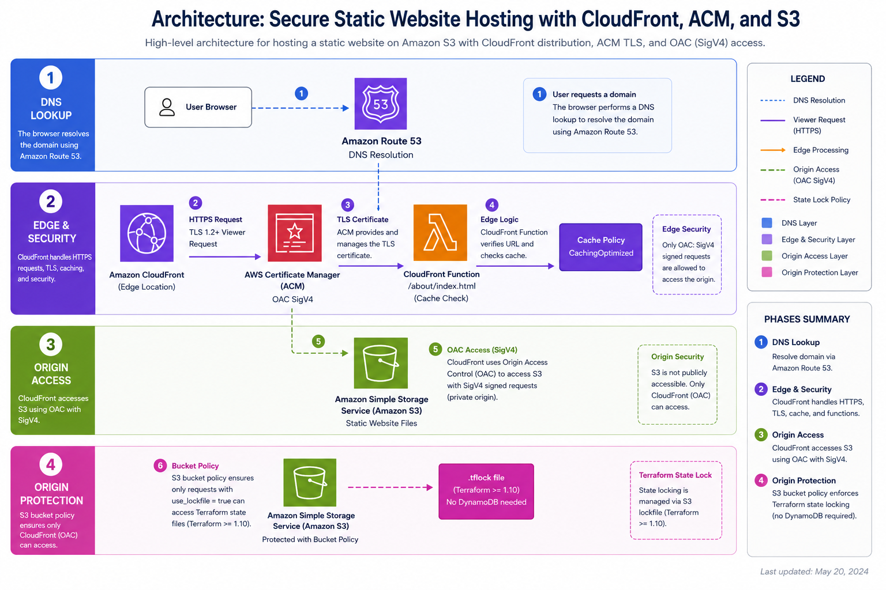

Most developers reach for Netlify or Cloudflare Pages (like this very site) for static hosting — and for good reason. But if your team is already deep in the AWS ecosystem, or your compliance requirements mandate a single-cloud strategy, you need to know how to build this the right way with Terraform.

This post walks you through the **full infrastructure stack** for a production-grade static site on AWS: S3, CloudFront, ACM, Route53, and a CloudFront Function that handles clean URL routing at the edge.

## Architecture Overview



> **Diagram key:** DNS lookup flows through Route 53 (dashed blue) → CloudFront edge validates TLS with ACM, rewrites URLs with the CloudFront Function, and applies the cache policy (solid purple/orange) → S3 origin is accessed via OAC SigV4 (dashed green). Terraform state locking uses a native S3 `.tflock` file instead of DynamoDB (dashed pink).

> **Why this specific stack?** CloudFront requires ACM certificates to be in `us-east-1` regardless of where your users or S3 bucket are. This is a common gotcha that trips up teams migrating from other clouds.

## Prerequisites

- AWS CLI configured with appropriate IAM permissions
- Terraform >= **1.10.0** (required for S3 native state locking — no DynamoDB table needed)
- A registered domain (can be in Route53 or any registrar)
- Your static site build output (e.g., `dist/` from Astro, `out/` from Next.js)

## Project Structure

```
infra/
├── main.tf                  # Provider config + backend
├── variables.tf             # Input variables
├── outputs.tf               # CloudFront domain, S3 bucket name
├── s3.tf                    # S3 bucket + policy
├── cloudfront.tf            # Distribution + OAC
├── cloudfront-function.tf   # URL rewriting for clean routes
├── acm.tf                   # Certificate + validation
└── route53.tf               # DNS records
```

## Step 1 — Provider and Backend

```hcl
# main.tf
terraform {
  required_version = ">= 1.10.0"
  required_providers {
    aws = {
      source  = "hashicorp/aws"
      version = "~> 5.0"
    }
  }

  # S3 backend with native state locking — no DynamoDB table needed!
  # Requires Terraform >= 1.10. Creates a .tflock file in the bucket
  # during apply/plan, then removes it on completion.
  backend "s3" {
    bucket       = "your-terraform-state-bucket"
    key          = "static-site/terraform.tfstate"
    region       = "us-east-1"
    encrypt      = true
    use_lockfile = true
  }
}

# Default provider for most resources
provider "aws" {
  region = var.aws_region
}

# ACM certificates MUST be in us-east-1 for CloudFront
provider "aws" {
  alias  = "us_east_1"
  region = "us-east-1"
}
```

### S3 native locking vs DynamoDB — what changed in Terraform 1.10

Before Terraform 1.10, you had to provision a DynamoDB table just to prevent concurrent `terraform apply` runs — extra cost, extra resource, extra IAM permissions. Since 1.10, the S3 backend manages locking natively by writing a `.tflock` file alongside your state file.

| | DynamoDB lock (legacy) | S3 native lock (`use_lockfile = true`) |
|---|---|---|
| Extra resource | ✅ DynamoDB table required | ❌ None |
| Cost | ~$0.25/month + read units | $0 (S3 PUT/DELETE) |
| IAM permissions needed | S3 + DynamoDB | S3 only |
| Minimum Terraform version | Any | >= 1.10 |

**Migration**: if you're upgrading from a DynamoDB-backed setup, remove `dynamodb_table` from the backend config, add `use_lockfile = true`, run `terraform init -reconfigure`, then destroy your DynamoDB lock table. Your state file is untouched.

## Step 2 — S3 Bucket with Origin Access Control

The modern approach uses **OAC** (Origin Access Control) instead of the legacy OAI. OAC supports SSE-S3 and SSE-KMS encrypted buckets and is the AWS-recommended method since 2022.

```hcl
# s3.tf
resource "aws_s3_bucket" "site" {
  bucket        = "${var.domain_name}-static-site"
  force_destroy = false

  tags = {
    Environment = var.environment
    Project     = var.project_name
    ManagedBy   = "terraform"
  }
}

# Block ALL public access — CloudFront uses OAC, not public URLs
resource "aws_s3_bucket_public_access_block" "site" {
  bucket                  = aws_s3_bucket.site.id
  block_public_acls       = true
  block_public_policy     = true
  ignore_public_acls      = true
  restrict_public_buckets = true
}

# Bucket policy — allow only CloudFront to read via OAC
resource "aws_s3_bucket_policy" "site" {
  bucket = aws_s3_bucket.site.id
  policy = jsonencode({
    Version = "2012-10-17"
    Statement = [{
      Sid    = "AllowCloudFrontOAC"
      Effect = "Allow"
      Principal = {
        Service = "cloudfront.amazonaws.com"
      }
      Action   = "s3:GetObject"
      Resource = "${aws_s3_bucket.site.arn}/*"
      Condition = {
        StringEquals = {
          "AWS:SourceArn" = aws_cloudfront_distribution.site.arn
        }
      }
    }]
  })
}
```

## Step 3 — ACM Certificate with DNS Validation

```hcl
# acm.tf
resource "aws_acm_certificate" "site" {
  provider                  = aws.us_east_1  # ← CRITICAL: must be us-east-1 for CloudFront
  domain_name               = var.domain_name
  subject_alternative_names = ["www.${var.domain_name}"]
  validation_method         = "DNS"

  lifecycle {
    create_before_destroy = true
  }
}

# Create the DNS validation records in Route53 automatically
resource "aws_route53_record" "cert_validation" {
  for_each = {
    for dvo in aws_acm_certificate.site.domain_validation_options : dvo.domain_name => {
      name   = dvo.resource_record_name
      record = dvo.resource_record_value
      type   = dvo.resource_record_type
    }
  }

  zone_id = data.aws_route53_zone.site.zone_id
  name    = each.value.name
  type    = each.value.type
  ttl     = 60
  records = [each.value.record]
}

resource "aws_acm_certificate_validation" "site" {
  provider                = aws.us_east_1
  certificate_arn         = aws_acm_certificate.site.arn
  validation_record_fqdns = [for record in aws_route53_record.cert_validation : record.fqdn]
}
```

## Step 4 — CloudFront Function for Clean URL Routing

This is the piece most Terraform guides skip, and it's the one that bites you in production.

Static site generators like Astro, Next.js (static export), and Hugo output `about/index.html` — not `about.html`. Without URL rewriting, a request to `yourdomain.com/about` hits S3 looking for a key named `about`, which doesn't exist, and CloudFront returns a 403.

**CloudFront Functions** execute in microseconds at every CloudFront edge location, before the request touches S3. They're the right tool for this: lightweight JavaScript (2.0 runtime), $0.10 per million invocations, zero cold starts.

```hcl
# cloudfront-function.tf
resource "aws_cloudfront_function" "url_rewrite" {
  name    = "${var.project_name}-url-rewrite"
  runtime = "cloudfront-js-2.0"
  comment = "Rewrite clean URLs to index.html for static site routing"
  publish = true

  code = <<-EOF
    function handler(event) {
      var request = event.request;
      var uri = request.uri;

      if (uri.endsWith('/')) {
        request.uri += 'index.html';
      } else if (!uri.includes('.')) {
        request.uri += '/index.html';
      }

      return request;
    }
  EOF
}
```

> **CloudFront Functions vs Lambda@Edge**: Functions run on the CloudFront network (not Lambda), execute in sub-millisecond time, and cost ~6x less. Use them for simple viewer-request transformations like URL rewriting. Use Lambda@Edge when you need response body access, external network calls, or a runtime beyond JavaScript.

## Step 5 — CloudFront Distribution

```hcl
# cloudfront.tf
resource "aws_cloudfront_origin_access_control" "site" {
  name                              = "${var.project_name}-oac"
  description                       = "OAC for ${var.domain_name}"
  origin_access_control_origin_type = "s3"
  signing_behavior                  = "always"
  signing_protocol                  = "sigv4"
}

resource "aws_cloudfront_distribution" "site" {
  enabled             = true
  is_ipv6_enabled     = true
  default_root_object = "index.html"
  aliases             = [var.domain_name, "www.${var.domain_name}"]
  price_class         = "PriceClass_100"  # US + Europe only = cheaper

  origin {
    domain_name              = aws_s3_bucket.site.bucket_regional_domain_name
    origin_id                = "S3-${aws_s3_bucket.site.id}"
    origin_access_control_id = aws_cloudfront_origin_access_control.site.id
  }

  default_cache_behavior {
    allowed_methods        = ["GET", "HEAD"]
    cached_methods         = ["GET", "HEAD"]
    target_origin_id       = "S3-${aws_s3_bucket.site.id}"
    viewer_protocol_policy = "redirect-to-https"
    compress               = true

    # AWS managed Cache-Optimized policy
    cache_policy_id = "658327ea-f89d-4fab-a63d-7e88639e58f6"

    # Attach the URL rewrite function to all viewer requests
    function_association {
      event_type   = "viewer-request"
      function_arn = aws_cloudfront_function.url_rewrite.arn
    }
  }

  # Return a real 404 page — the CF Function handles legitimate routes,
  # so a 403/404 from S3 means the resource genuinely doesn't exist.
  custom_error_response {
    error_code            = 403
    response_code         = 404
    response_page_path    = "/404.html"
    error_caching_min_ttl = 10
  }

  custom_error_response {
    error_code            = 404
    response_code         = 404
    response_page_path    = "/404.html"
    error_caching_min_ttl = 10
  }

  viewer_certificate {
    acm_certificate_arn      = aws_acm_certificate_validation.site.certificate_arn
    ssl_support_method        = "sni-only"
    minimum_protocol_version  = "TLSv1.2_2021"
  }

  restrictions {
    geo_restriction {
      restriction_type = "none"
    }
  }
}
```

> **Why `403→404` instead of `403→200/index.html`?** The old SPA trick returns your `index.html` for every 404/403 so the SPA router can handle routing client-side. For a static site, every page is a real HTML file — the CloudFront Function already rewrites `/about` to `/about/index.html` before S3 sees the request. A 403 reaching this `custom_error_response` means the file genuinely does not exist, so returning 404 is correct. The SPA trick breaks static site SEO because crawlers see a 200 on non-existent URLs.

## Step 6 — Route53 DNS Records

```hcl
# route53.tf
data "aws_route53_zone" "site" {
  name         = var.domain_name
  private_zone = false
}

# Apex domain → CloudFront (A alias record — free, no TTL issues)
resource "aws_route53_record" "apex" {
  zone_id = data.aws_route53_zone.site.zone_id
  name    = var.domain_name
  type    = "A"

  alias {
    name                   = aws_cloudfront_distribution.site.domain_name
    zone_id                = aws_cloudfront_distribution.site.hosted_zone_id
    evaluate_target_health = false
  }
}

# www subdomain → same CloudFront distribution
resource "aws_route53_record" "www" {
  zone_id = data.aws_route53_zone.site.zone_id
  name    = "www.${var.domain_name}"
  type    = "A"

  alias {
    name                   = aws_cloudfront_distribution.site.domain_name
    zone_id                = aws_cloudfront_distribution.site.hosted_zone_id
    evaluate_target_health = false
  }
}
```

## Deployment Workflow

```bash
# 1. Initialize Terraform (downloads providers, configures S3 backend)
terraform init

# 2. Review the plan — always read this carefully before applying
terraform plan -var-file="prod.tfvars"

# 3. Apply — creates ~16 resources
# ACM DNS validation + CloudFront propagation can take 10–15 min
terraform apply -var-file="prod.tfvars"

# 4. Upload your site files
aws s3 sync ./dist s3://$(terraform output -raw s3_bucket_name) \
  --delete \
  --cache-control "public, max-age=31536000, immutable"

# 5. Invalidate CloudFront cache after updates (not needed on first deploy)
aws cloudfront create-invalidation \
  --distribution-id $(terraform output -raw cloudfront_distribution_id) \
  --paths "/*"
```

## Cost Comparison: AWS vs Cloudflare Pages

| Resource | AWS/month | Cloudflare Pages/month |
|---|---|---|
| Storage (S3, 5GB) | ~$0.12 | $0 |
| CloudFront (100GB transfer) | ~$8.50 | $0 |
| Route53 hosted zone | $0.50 | $0 (if domain on CF) |
| ACM certificate | $0 | $0 |
| CloudFront Function | ~$0.01 | $0 |
| **Total** | **~$9–15/month** | **$0** |

For a personal portfolio or marketing site, **Cloudflare Pages is the obvious choice**. AWS shines when you need it as part of a larger AWS ecosystem, have compliance requirements, or need advanced CloudFront behaviors like Lambda@Edge or response manipulation.

## Key Takeaways

1. **OAC over OAI** — Always use Origin Access Control for new distributions. OAI is legacy.
2. **ACM in us-east-1** — This trips up almost everyone the first time. Set it as a provider alias.
3. **`create_before_destroy`** — Essential on ACM certificates to avoid downtime during renewal.
4. **S3 native lock over DynamoDB** — On Terraform >= 1.10, `use_lockfile = true` eliminates the DynamoDB table entirely. Simpler IAM, lower cost, one less resource to manage.
5. **CloudFront Function for URL rewriting** — Attach a `viewer-request` function to normalize `/about` → `/about/index.html`. This is the correct pattern for static sites, not the `403→200/index.html` SPA workaround.
6. **`403→404` in `custom_error_response`** — With the CF Function in place, a 403 from S3 means the file doesn't exist. Return 404 — it's the correct HTTP semantics and better for SEO.

The full Terraform code for this post is available in my [GitHub repository](https://github.com/Carlosposada-Dev).
